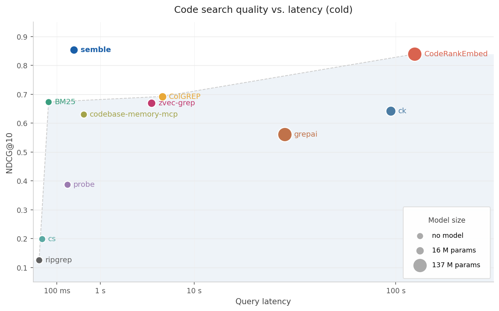

<h2 align="center">
  <br/>
  Fast and Accurate Code Search for Agents
</h2>

<div align="center">
  <h2>
    <a href="https://pypi.org/project/semble/"></a>
    <a href="https://github.com/MinishLab/semble/blob/main/LICENSE">
      
    </a>
  </h2>

[Quickstart](#quickstart) •
[Main Features](#main-features) •
[MCP Server](#mcp-server) •
[Benchmarks](#benchmarks)

</div>

Semble is a code search library built for agents. It returns the exact code snippets they need instantly, cutting both token usage and waiting time on every step. Indexing and searching a full codebase end-to-end takes under a second, with ~200x faster indexing and ~10x faster queries than a code-specialized transformer, at 99% of its retrieval quality (see [benchmarks](#benchmarks)). Everything runs on CPU with no API keys, GPU, or external services. Run it as an [MCP server](#mcp-server) and any agent (Claude Code, Cursor, Codex, OpenCode, etc.) gets instant access to any repo, cloned and indexed on demand.

## Quickstart

```bash
pip install semble  # Install with pip
uv add semble       # Install with uv
```

```python
from semble import SembleIndex

# Index a local directory
index = SembleIndex.from_path("./my-project")

# Index a remote git repository
index = SembleIndex.from_git("https://github.com/MinishLab/model2vec")

results = index.search("save model to disk", top_k=3)

# Each result exposes the matched chunk
result = results[0]
result.chunk.file_path   # "model2vec/model.py"
result.chunk.start_line  # 127
result.chunk.end_line    # 150
result.chunk.content     # "def save_pretrained(self, path: PathLike, ..."

# Find code similar to a specific result
related = index.find_related(results[0], top_k=3)
```

## Main Features

- **Fast**: indexes a repo in ~250 ms and answers queries in ~1.5 ms, all on CPU.
- **Accurate**: NDCG@10 of 0.854 on our benchmarks, on par with code-specialized transformer models, at a fraction of the size and cost.
- **Local and remote**: pass a local path or a git URL.
- **MCP server**: drop-in tool for Claude Code, Cursor, Codex, OpenCode, and any other MCP-compatible agent.
- **Zero setup**: runs on CPU with no API keys, GPU, or external services required.

## MCP Server

Semble can run as an MCP server so agents can search any codebase directly. Repos are cloned and indexed on demand, and indexes are cached for the lifetime of the session.

### Setup

#### Claude Code
```bash
claude mcp add semble -s user -- uvx --from "semble[mcp]" semble
```

#### Codex
Add to `~/.codex/config.toml`:
```toml
[mcp_servers.semble]
command = "uvx"
args = ["--from", "semble[mcp]", "semble"]
```

#### OpenCode
Add to `~/.opencode/config.json`:
```json
{
  "mcp": {
    "semble": {
      "type": "local",
      "command": ["uvx", "--from", "semble[mcp]", "semble"]
    }
  }
}
```

#### Cursor
Add to `~/.cursor/mcp.json` (or `.cursor/mcp.json` in your project):
```json
{
  "mcpServers": {
    "semble": {
      "command": "uvx",
      "args": ["--from", "semble[mcp]", "semble"]
    }
  }
}
```

### Tools

| Tool | Description |
|------|-------------|
| `search` | Search a codebase with a natural-language or code query. Pass `repo` as a git URL or local path. |
| `find_related` | Given a file path and line number, return chunks semantically similar to the code at that location. |

## Benchmarks

Quality and speed across all methods on ~1,250 queries over 63 repositories in 19 languages. X-axis is total latency (index + first query); y-axis is NDCG@10. Marker size reflects model parameter count.



| Method | NDCG@10 | Index time | Query p50 |
|--------|--------:|-----------:|----------:|
| ripgrep | 0.126 | — | 12 ms |
| ColGREP | 0.693 | 5.8 s | 124 ms |
| CodeRankEmbed | 0.765 | 57 s | 16 ms |
| semble | 0.854 | **263 ms** | **1.5 ms** |
| CodeRankEmbed Hybrid | **0.862** | 57 s | 16 ms |

The 137M-parameter CodeRankEmbed Hybrid leads NDCG@10 by 0.008. Semble indexes 218x faster and answers queries 11x faster. See [benchmarks](benchmarks/README.md) for per-language results, ablations, and methodology.

## License

MIT

## Citing

If you use Semble in your research, please cite the following:

```bibtex
@software{minishlab2026semble,
  author       = {{van Dongen}, Thomas and Stephan Tulkens},
  title        = {Semble: Fast Code Search for Agents},
  year         = {2026},
  publisher    = {Zenodo},
  doi          = {10.5281/zenodo.XXXXXXX},
  url          = {https://github.com/MinishLab/semble},
  license      = {MIT}
}
```
