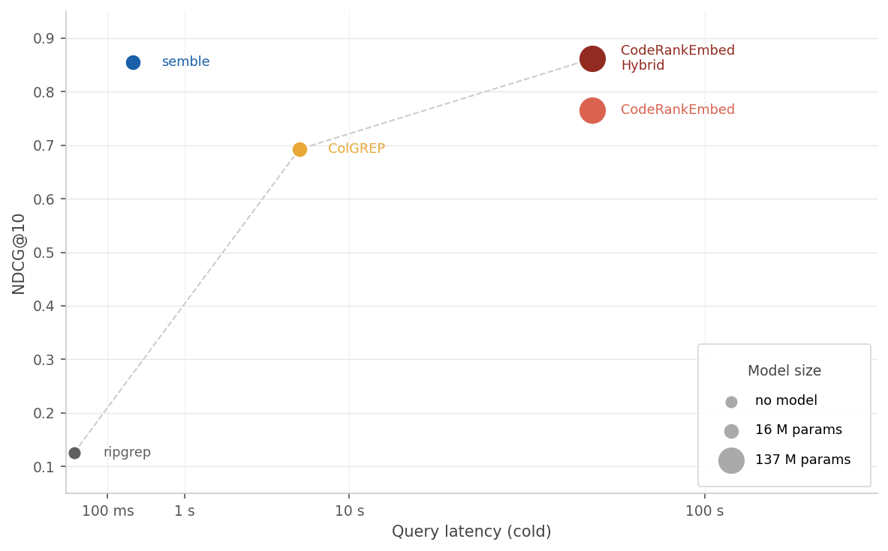
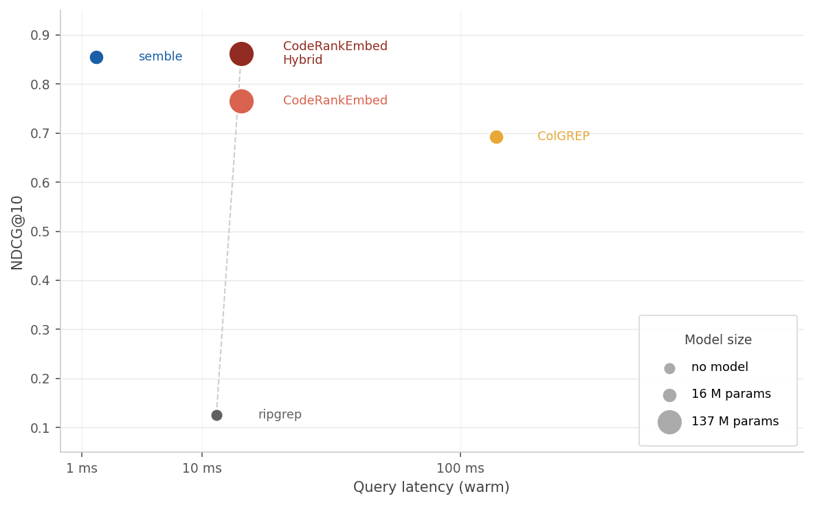

# Benchmarks

Quality and speed benchmarks for `semble` across 63 repositories in 19 languages.

## Dataset

3 repositories per language (9 for Python), covering:
bash, C, C++, C#, Elixir, Go, Haskell, Java, JavaScript, Kotlin, Lua, PHP, Python, Ruby, Rust, Scala, Swift, TypeScript, Zig.

1,258 annotated queries in three categories:

| Category | Queries | Description |
|---|---|---|
| semantic | 711 | Find code that implements a specific behavior or concept |
| architecture | 343 | Understand design decisions, module boundaries, or structural patterns |
| symbol | 204 | Look up a named entity (function, class, type, variable) |

## Results

Quality is NDCG@10 averaged across all queries. Index time and query p50 are from the speed benchmark (one repo per language, cold start, CPU-only).

| Method | NDCG@10 | Index time | Query p50 |
|---|---|---|---|
| ripgrep | 0.126 | — | 12 ms |
| ColGREP | 0.693 | 5.8 s | 124 ms |
| CodeRankEmbed | 0.765 | 57 s | 16 ms |
| **semble** | **0.854** | **263 ms** | **1.5 ms** |
| CodeRankEmbed Hybrid | 0.862 | 57 s | 16 ms |

semble reaches 0.854 NDCG@10, close to CodeRankEmbed Hybrid (0.862, a 137M-param transformer), while indexing 218x faster and querying 11x faster.

|  |  |
|:--:|:--:|
| *Time to first result (index + query) vs NDCG@10* | *Query latency (warm index) vs NDCG@10* |

### By query category

| Method | Architecture | Semantic | Symbol |
|---|---|---|---|
| CodeRankEmbed Hybrid | 0.811 | 0.863 | 0.941 |
| **semble** | 0.802 | 0.846 | **0.958** |
| CodeRankEmbed | 0.690 | 0.777 | 0.845 |

semble leads on symbol queries (0.958 vs 0.941) where BM25 excels at exact name matching. Architecture queries are the hardest for all methods; CodeRankEmbed Hybrid holds a small edge there (0.811 vs 0.802).

### By language

NDCG@10 per language (3 repos each, except Python which has 9), sorted by CodeRankEmbed Hybrid:

| Language | semble | CRE Hybrid | CRE | ColGREP | ripgrep |
|---|---|---|---|---|---|
| scala | 0.909 | 0.922 | 0.845 | 0.765 | 0.180 |
| cpp | 0.915 | 0.913 | 0.846 | 0.626 | 0.126 |
| ruby | 0.909 | 0.909 | 0.769 | 0.708 | 0.230 |
| elixir | 0.894 | 0.905 | 0.869 | 0.808 | 0.134 |
| javascript | 0.917 | 0.903 | 0.920 | 0.823 | 0.176 |
| zig | 0.913 | 0.901 | 0.807 | 0.474 | 0.000 |
| csharp | 0.885 | 0.889 | 0.743 | 0.614 | 0.117 |
| go | 0.895 | 0.884 | 0.676 | 0.785 | 0.133 |
| python | 0.867 | 0.880 | 0.794 | 0.777 | 0.202 |
| php | 0.858 | 0.874 | 0.758 | 0.663 | 0.123 |
| swift | 0.860 | 0.873 | 0.721 | 0.710 | 0.160 |
| bash | 0.825 | 0.852 | 0.892 | 0.706 | 0.000 |
| lua | 0.823 | 0.847 | 0.803 | 0.798 | 0.000 |
| java | 0.849 | 0.841 | 0.706 | 0.641 | 0.198 |
| kotlin | 0.821 | 0.830 | 0.670 | 0.637 | 0.166 |
| rust | 0.856 | 0.827 | 0.627 | 0.662 | 0.162 |
| c | 0.741 | 0.806 | 0.706 | 0.676 | 0.000 |
| haskell | 0.765 | 0.771 | 0.776 | 0.683 | 0.000 |
| typescript | 0.706 | 0.708 | 0.545 | 0.430 | 0.128 |
| **overall** | **0.854** | **0.862** | **0.765** | **0.693** | **0.126** |

semble and CRE Hybrid are within 0.03 of each other across every language. ColGREP shows the most variance: scores near the overall average (0.693) for well-covered languages like Python (0.777), Go (0.785), and Elixir (0.808), but drops significantly for Zig (0.474), TypeScript (0.430), and header-heavy C++ (abseil-cpp pulls cpp down to 0.626). The Zig gap is the largest of any tool–language pair and is consistent across all three Zig repos (zig=0.389, zig-clap=0.494, zls=0.540), pointing to limited training coverage for this relatively new language. The TypeScript gap is driven by monorepo repos (zod, vitest) where many semantically distinct queries share the same ground-truth file (`api.ts`, `core.ts`) — a distribution ColGREP's retrieval does not handle well. ripgrep scores zero on Zig, Lua, C, Bash, and Haskell because none of the queries in those repos contain keyword substrings that appear in the relevant files.

## Ablations

`raw` returns retrieval scores directly; `+ ranking` feeds them through semble's hybrid ranker.

| Retrieval | NDCG@10 (raw) | NDCG@10 (+ ranking) |
|---|---|---|
| BM25 | 0.675 | 0.834 |
| potion-code-16M | 0.650 | 0.821 |
| BM25 + potion-code-16M | — | **0.854** |

The ranking stack adds roughly +0.16 NDCG@10 for both retrieval methods. Combining them adds another ~0.02 on top.

<details>
<summary>By query category</summary>

| Mode | Architecture | Semantic | Symbol |
|---|---|---|---|
| BM25 raw | 0.628 | 0.676 | 0.719 |
| potion-code-16M raw | 0.626 | 0.666 | 0.629 |
| semble BM25 (+ ranking) | 0.770 | 0.819 | 0.957 |
| semble potion-code-16M (+ ranking) | 0.757 | 0.808 | 0.943 |
| **semble hybrid** | **0.802** | **0.846** | **0.958** |

</details>

## Running the benchmarks

### Setup

Pinned repositories live in `repos.json` and are checked out into `~/.cache/semble-bench`.

```bash
uv run python -m benchmarks.sync_repos          # clone / update
uv run python -m benchmarks.sync_repos --check  # verify only
```

- All tools run CPU-only
- semble model: `minishlab/potion-code-16M`
- coderankembed model: `nomic-ai/CodeRankEmbed` (137M params)
- Speed benchmark: 19 repos (one per language), cold-start index, 5 query runs per repo

### Plot

Requires the `benchmark` extra (`uv sync --extra benchmark`).

```bash
uv run python -m benchmarks.plot
```

Saves `speed_vs_ndcg_cold.png` (cold) and `speed_vs_ndcg_warm.png` (warm) to `benchmarks/results/`.

### semble

```bash
uv run python -m benchmarks.run_benchmark
uv run python -m benchmarks.run_benchmark --repo fastapi --repo axios
uv run python -m benchmarks.run_benchmark --language python
```

Full runs save results to `benchmarks/results/semble-hybrid-<sha12>.json`.

### Speed benchmark

```bash
uv run python -m benchmarks.speed_benchmark
```

Results are saved to `benchmarks/results/speed-<sha12>.json`.

### Ablations

```bash
uv run python -m benchmarks.baselines.ablations
uv run python -m benchmarks.baselines.ablations --mode bm25
uv run python -m benchmarks.baselines.ablations --mode semble-semantic
```

### ripgrep

Requires `rg` on `$PATH` (`brew install ripgrep` / `apt install ripgrep`).

```bash
uv run python -m benchmarks.baselines.ripgrep
uv run python -m benchmarks.baselines.ripgrep --no-fixed-strings
```

### ColGREP

Requires the `colgrep` binary on `$PATH`.

```bash
uv run python -m benchmarks.baselines.colgrep
uv run python -m benchmarks.baselines.colgrep --repo fastapi --repo axios
```

ColGREP is run with `--code-only` (its default) for all non-bash repos. Bash repos (bash-it, bats-core, nvm) use `--no-code-only` because ColGREP's `--code-only` excludes `.sh`/`.bash` files, which are the primary source files in those repos.

### CodeRankEmbed

Requires the `benchmark` extra (`uv sync --extra benchmark`).

```bash
uv run python -m benchmarks.baselines.coderankembed
uv run python -m benchmarks.baselines.coderankembed --mode semantic
```
