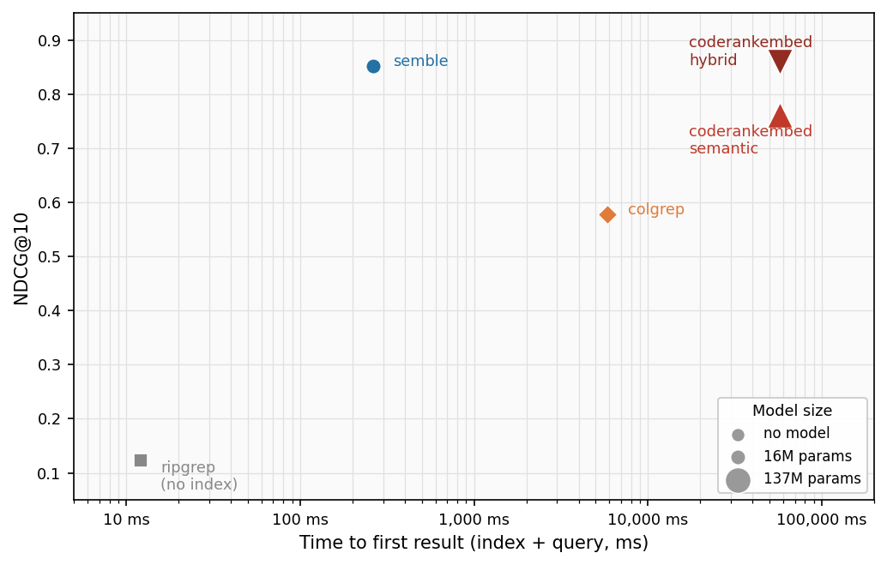

# Benchmarks

Quality and speed benchmarks for `semble` across 63 repositories in 19 languages.

## Dataset

3 repositories per language (9 for Python), covering:
bash, C, C++, C#, Elixir, Go, Haskell, Java, JavaScript, Kotlin, Lua, PHP, Python, Ruby, Rust, Scala, Swift, TypeScript, Zig.

1,258 annotated queries in three categories:

| Category | Queries | Description |
|---|---|---|
| semantic | 711 | Find code that implements a specific behavior or concept |
| architecture | 343 | Understand design decisions, module boundaries, or structural patterns |
| symbol | 204 | Look up a named entity (function, class, type, variable) |

## Results

Quality is NDCG@10 averaged across all queries. Index time and query p50 are from the speed benchmark (one repo per language, cold start, CPU-only).

| Method | NDCG@10 | Index time | Query p50 |
|---|---|---|---|
| ripgrep | 0.123 | — | 12 ms |
| colgrep | 0.577 | 5.8 s | 124 ms |
| coderankembed semantic | 0.762 | 57 s | 16 ms |
| **semble** | **0.852** | **263 ms** | **1.5 ms** |
| coderankembed hybrid | 0.860 | 57 s | 16 ms |

semble reaches 0.852 NDCG@10, close to coderankembed hybrid (0.860, a 137M-param transformer), while indexing 218x faster and querying 11x faster.

|  |
|:--:|
| *Time to first result (index + query) vs NDCG@10. Marker size scales with model parameter count.* |

### By query category

| Method | Architecture | Semantic | Symbol |
|---|---|---|---|
| coderankembed hybrid | 0.811 | 0.863 | 0.941 |
| **semble** | 0.802 | 0.846 | **0.958** |
| coderankembed semantic | 0.690 | 0.777 | 0.845 |

semble leads on symbol queries (0.958 vs 0.941) where BM25 excels at exact name matching. Architecture queries are the hardest for all methods; coderankembed hybrid holds a small edge there (0.811 vs 0.802).

## Ablations

`raw` returns retrieval scores directly; `+ ranking` feeds them through semble's hybrid ranker.

| Retrieval | NDCG@10 (raw) | NDCG@10 (+ ranking) |
|---|---|---|
| BM25 | 0.675 | 0.834 |
| potion-code-16M | 0.650 | 0.821 |
| BM25 + potion-code-16M | — | **0.852** |

The ranking stack adds roughly +0.16 NDCG@10 for both retrieval methods. Combining them adds another ~0.02 on top.

<details>
<summary>By query category</summary>

| Mode | Architecture | Semantic | Symbol |
|---|---|---|---|
| BM25 raw | 0.628 | 0.676 | 0.719 |
| potion-code-16M raw | 0.626 | 0.666 | 0.629 |
| semble BM25 (+ ranking) | 0.770 | 0.819 | 0.957 |
| semble potion-code-16M (+ ranking) | 0.757 | 0.808 | 0.943 |
| **semble hybrid** | **0.802** | **0.846** | **0.958** |

</details>

## Running the benchmarks

### Setup

Pinned repositories live in `repos.json` and are checked out into `~/.cache/semble-bench`.

```bash
uv run python -m benchmarks.sync_repos          # clone / update
uv run python -m benchmarks.sync_repos --check  # verify only
```

- All tools run CPU-only
- semble model: `minishlab/potion-code-16M`
- coderankembed model: `nomic-ai/CodeRankEmbed` (137M params)
- Speed benchmark: 19 repos (one per language), cold-start index, 5 query runs per repo

### Plot

Requires the `benchmark` extra (`uv sync --extra benchmark`).

```bash
uv run python -m benchmarks.plot
```

Saves to `benchmarks/results/speed_vs_ndcg.png`.

### semble

```bash
uv run python -m benchmarks.run_benchmark
uv run python -m benchmarks.run_benchmark --repo fastapi --repo axios
uv run python -m benchmarks.run_benchmark --language python
```

Full runs save results to `benchmarks/results/semble-hybrid-<sha12>.json`.

### Speed benchmark

```bash
uv run python -m benchmarks.speed_benchmark
```

Results are saved to `benchmarks/results/speed-<sha12>.json`.

### Ablations

```bash
uv run python -m benchmarks.baselines.ablations
uv run python -m benchmarks.baselines.ablations --mode bm25
uv run python -m benchmarks.baselines.ablations --mode semble-semantic
```

### ripgrep

Requires `rg` on `$PATH` (`brew install ripgrep` / `apt install ripgrep`).

```bash
uv run python -m benchmarks.baselines.ripgrep
uv run python -m benchmarks.baselines.ripgrep --no-fixed-strings
```

### ColGREP

Requires the `colgrep` binary on `$PATH`.

```bash
uv run python -m benchmarks.baselines.colgrep --init   # build indexes once
uv run python -m benchmarks.baselines.colgrep
```

### CodeRankEmbed

Requires the `benchmark` extra (`uv sync --extra benchmark`).

```bash
uv run python -m benchmarks.baselines.coderankembed
uv run python -m benchmarks.baselines.coderankembed --mode semantic
```
